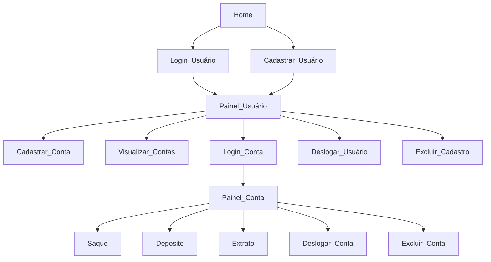

<h1>  Desafio Python v1</h1>

<br>

### Descrição:
O desafio proposto consiste na criação de um sistema bancario simples com as opções `sacar`, `depositar` e `visualizar extrato`.

### Regras de negócio:

1. Os usuários que realizarem a operação `sacar` só podem realizar 3 saques por dia, onde cada um deve ser de no máximo R$500;
2. Ao realizar a operações `sacar` ou `depositar`, deve-se armazenado o valor e a data/hora da operação para posteriormente poder ser visualizada na operação `visualizar extrato`;
3. A operação `visualizar extrato` deve listar os registros por data em ordem decrescente no terminal (a data mais antiga até a mais atual).

<br>

## Funcionalidades

### Fluxo das funcionalidades



### Home
---


### Login_Usuário

> Solicita um E-mail e verifica se ele está presente no Registro de Usuário, se sim solicita a senha e confere se ela coincide com a do registro, caso coincida redireciona o usuário para o Painel_Usuário.
>
>  

### Cadastrar_Usuário

> Solicita um E-mail e um CPF e verifica se eles não estão presentes no Registro de Usuários, caso não estejam solicita outras informações (Nome, Data de Nascimento, Endereço e Senha), caso tudo tenha dado certo redireciona o usuário para o Painel_Usuário.
>
> 


<br>

### Painel_Usuário
---


### Cadastrar_Conta

> Solicita um número de Agência e uma Senha, caso tudo tenha dado certo a conta é criada com sucesso.
>
> 


### Visualizar_Contas

> Mostra todas as contas cadastradas do usuário, mostrando o saldo e a data de criação de cada uma delas.
>
> 


### Login_Conta

> Solicita a Agência, o número da conta e a senha e verifica se estas informações existem no Registro de Contas, caso exista redireciona o usuário para o Painel_Conta.
> 
> 


### Excluir_Cadastro

> Solicita a senha do cadastro para confirmar a deleção permanente do usuário, caso ela esteja certa o usuário é excluído e redirecionado para Home.
>
> 


### Deslogar_Usuário

> Encerra a seção do usuário e redireciona ele para Home.

<br>

### Painel_Conta
---


### Sacar (Withdraw)

> #### Etapas
>
> 1 - Verificação de Saques Diários:
>
> Antes de efetuar um saque, o sistema verifica a quantidade de saques diários disponíveis. Se essa quantidade estiver esgotada, é verificado se a última regeneração ocorreu na data atual. Em caso afirmativo, os saques diários são automaticamente regenerados, restabelecendo o valor máximo permitido.
>
> 2 - Solicitação de Valor de Saque:
>
> O usuário é então solicitado a inserir o valor desejado para o saque. Se o valor informado for zero, a operação é cancelada. Se o valor exceder R$500 ou não for um número válido, uma mensagem é exibida, alertando sobre a invalidade dos valores.
>
> 3 - Processamento de Saque Válido:
>
> Caso o valor informado seja válido, o número de saques diários restantes é reduzido, o saldo do usuário é diminuido, e os detalhes da transação, incluindo valor e data/hora, são armazenados em uma variável de extrato.
>
> 


### Depositar (Deposit)

> #### Etapas
>
> 1 - Solicitação de Valor de Deposito
>
> O usuário é solicitado a inserir o valor para o deposito. Se o valor informado for zero, a operação é cancelada. Se o valor não for um número válido, uma mensagem é exibida, alertando sobre a invalidade do valor.
>
> 2 - Caso o valor informado seja válido, o saldo do usuário é aumentado, e os detalhes da transação, incluindo valor e data/hora, são armazenados em uma variável de extrato.
> 
> 


### Extrato (Show_Statements)

> É carregado as informações armazenadas no extrato e exibida no terminal em ordem descrescente ordenada pela data/hora, também é mostrado o número total de saques e depositos realizados pela conta.
>
> 


### Excluir_Conta

> Solicita a senha da conta para confirmar a deleção permanente dela, caso ela esteja certa a conta é excluída e redirecionado para Painel_Usuário.
>
> 


### Deslogar_Conta

> Encerra a seção da conta do usuário e redireciona ele para Painel_Usuário.

<br>

## Getting Started

### Pre-requisitos

Para rodar o projeto é necessário ter instalado em sua máquina o `Python v3.12.2+`, você pode realizar a instalação dele [aqui](https://www.python.org/downloads/).
<br><br>

### Instalação

#### Clonando o repositório

```bash
$ git clone https://github.com/Delgado-tech/python-bank-challenge.git
$ git checkout v2
```

#### Seleção do ambiente virtual

Para baixar e configurar o ambiente virtual do projeto no VSCode, siga os passos abaixo:

> 1 - Baixe o ambiente virtual venv com: `python -m venv .venv`
>
> 2 - Pressione `[Ctrl+P]` para abrir a caixa de comandos.
>
> 3 - Digite `> Python: Select Interpreter` e pressione `[Enter]`.
>
> 4 - Uma janela será exibida, nela clique na opção `Python 3.12.2 ('.venv':venv)`.
>
> 5 - Baixe as dependências do projeto com: `pip install -r .\requirements.txt`

Com essas etapas concluídas, você estará utilizando o ambiente virtual do projeto junto com as dependências necessárias.
<br><br>

### Inicialização

Com seu projeto configurado, abra o terminal do seu VSCode e rode o comando:

```shell
$ python main.py
```

Se tudo funcionou aparecerá o menu Home no seu console.


Pronto! Agora você pode se divertir com o projeto!


